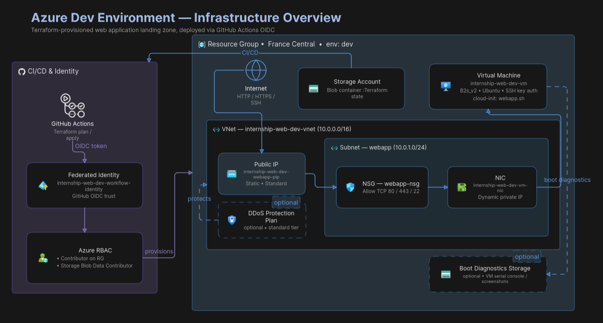
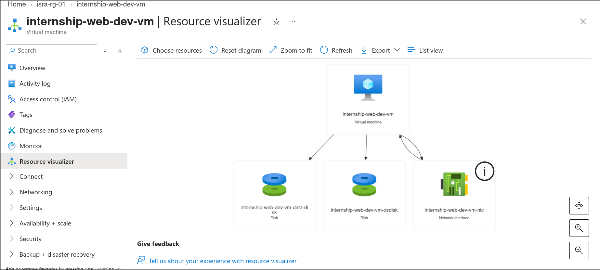
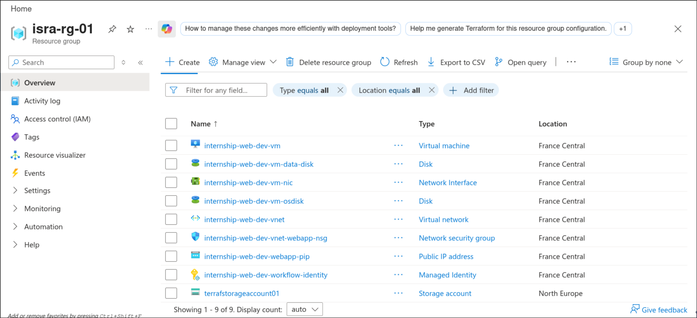

# Terraform Modules — Monolithic VM Infrastructure

> **Branch:** `release/1vm`  
> **Purpose:** Provision a single Azure VM that runs the entire application stack (Nginx, Node.js, PostgreSQL) via cloud-init.  
> **Application:** [`secure-login-demo`](https://github.com/askri-7/secure-login-demo)

---

## What This Is

This branch contains the infrastructure-as-code for a **classic monolithic deployment**. It provisions one virtual machine in Azure and deploys the full-stack application onto it using a cloud-init bootstrap script.

This is the simplest possible production-grade setup: one server, one database, one web server. No containers, no orchestration, no managed identity vaults.

---

## Repository Structure

```
.
├── documentation/          # Architecture docs
├── app /                   # secure login system demo
├── environment/            # Root configs per environment (calls modules)
│   ├── dev/
    ├── qa/
    ├── demo/
│   ├── preprod/
│   ├── prod/
│   
├── modules/                 # Reusable Terraform building blocks
│   ├── RG/                  # Resource Group module
    ├── workflow_identity      # the github action identity         
│   ├── VM/                  # Virtual Machine module
    ├── public_ip/          # public ip generator
│   └── Vnet/                # Virtual Network module
└── README.md
```
## Infrastructure architecture : monolithic application




## The Stack on the VM

| Layer | Technology | Role |
|-------|-----------|------|
| Edge / TLS | Nginx + Certbot | Handles HTTPS, routes `/api` to the backend, serves the React frontend |
| Runtime | Node.js 24 + PM2 | Runs the NestJS application as a managed process |
| Database | PostgreSQL 16 | Stores users, roles, refresh tokens, and audit logs |
| Data Disk | Azure-managed disk (ext4) | Mounted directly at PostgreSQL's data directory for persistence and growth |
| Bootstrap | cloud-init | Clones the application repository, installs dependencies, builds, and starts everything |

---

## How Deployment Works

### 1. Infrastructure Provisioning (GitHub Actions → Terraform)

When you push to this repository or trigger a workflow, GitHub Actions authenticates to Azure using **OpenID Connect (OIDC)** — no long-lived passwords or secrets stored in GitHub. Terraform then creates or updates:

- A Resource Group
- A Virtual Network and Subnet
- A Network Security Group (NSG) allowing TCP 22, 80, and 443
- A Public IP address
- A Virtual Machine with a data disk attached



### 2. Application Installation (cloud-init)

When the VM boots for the first time, Azure feeds it a cloud-init script. That script does not use Docker or any container runtime. Instead, it:

1. Updates the operating system.
2. Installs Nginx, Certbot, Node.js, PM2, and PostgreSQL.
3. Formats and mounts the attached data disk directly to PostgreSQL's data directory.
4. Clones the application repository (branch of your choice) directly from GitHub.
5. Writes a `.env` file on the server with runtime configuration.
6. Installs dependencies, generates the Prisma client, runs database migrations, and seeds the admin account.
7. Builds the frontend and copies it into Nginx's web root.
8. Obtains an SSL certificate from Let's Encrypt.
9. Starts the backend under PM2 and enables all services to survive reboots.

The application is live immediately after the VM finishes booting.

---

## Network Layout

```
Internet
    │
    ▼
┌─────────────┐     ┌─────────────┐     ┌─────────────┐
│  Public IP  │────→│     NSG     │────→│     VM      │
│  (static)   │     │  TCP 80/443 │     │  (NIC)      │
└─────────────┘     │  TCP 22     │     └──────┬──────┘
                    └─────────────┘            │
                                               │
                                        ┌──────┴──────┐
                                        │   VNet      │
                                        │ 10.0.0.0/16 │
                                        │   Subnet    │
                                        │10.0.1.0/24  │
                                        └─────────────┘
```

- **Port 80/443**: Nginx serves the React frontend and proxies `/api` to the Node.js backend.
- **Port 22**: SSH access for emergency maintenance (key-based only).
- **No other ports are exposed.** The PostgreSQL port (5432) is bound to `localhost` only and is unreachable from the internet.

---

## Security Model (This Branch)

This branch is intentionally minimal. It does **not** use:

- **Azure Key Vault** — secrets are passed through Terraform variables and rendered into the cloud-init script. The `.env` file on the server is restricted to `root:root` with `600` permissions.
- **Docker / Containers** — the application runs natively on the VM. Process isolation is handled by the OS.
- **Load Balancer** — a single VM handles all traffic. For a demo or low-traffic production app, this is sufficient.
- **Private Endpoint / VNet Integration** — the database lives on the same machine as the app. There is no network hop between application and data layer.

### What is protected

- **SSH**: Key-based authentication only. Password auth is disabled by default on Azure Ubuntu images.
- **Database**: PostgreSQL listens on `localhost` only. No remote TCP access.
- **Tokens**: The application uses `httpOnly`, `SameSite=Lax` cookies for refresh tokens. LocalStorage is not used for session data.
- **SSL**: Certbot provisions and auto-renews a Let's Encrypt certificate. All HTTP traffic is redirected to HTTPS.
- **Cloud-init cleanup**: The script shreds its own logs and user-data at the end of the run to reduce the chance of secret leakage on disk.

---


## CI/CD Identity

GitHub Actions does not use a service principal secret. Instead, it uses a **Federated Identity Credential**:

1. Azure trusts GitHub's OIDC token issuer.
2. The workflow requests a short-lived token from Azure AD.
3. Azure verifies the token (repository, branch, workflow name) and issues temporary credentials.
4. Terraform runs with those credentials and stops when the job ends.

This eliminates secret rotation for infrastructure pipelines.

---

## When to Use This Branch

Use `release/1vm` when:

- You want the **fastest path to production** for a monolithic app.
- Your traffic is low to moderate (a single B2s_v2 or larger VM is enough).
- You want to avoid the operational overhead of Kubernetes, container registries, and service meshes.
- You are running a demo, internship project, or early-stage product.

## When NOT to Use This Branch

Do not use this branch if you need:

- **High availability** — a single VM is a single point of failure.
- **Auto-scaling** — you must manually resize or redeploy to change capacity.
- **Secret rotation** — secrets live on disk in `.env` and in Terraform state.
- **Multi-region** — everything is provisioned in one Azure region.
- **Microservices** — this is designed for one codebase, one deployable unit.

For those needs, consider a containerized branch with Azure Container Apps, AKS, or App Service.

---

## Quick Start (Conceptual)

1. **Set up the OIDC trust** (one time): Run the `workflow_identity` module to allow GitHub Actions to talk to Azure.
2. **Pick an environment**: Navigate to `environment/dev/`.
3. **Provide variables**: Domain name, GitHub repo URL, branch, database credentials, OAuth app credentials, etc.
4. **Run the pipeline**: Push or trigger the workflow. Terraform creates the VM.
5. **Wait for cloud-init**: The VM boots, installs everything, and the app is live at your domain within ~3–5 minutes.

---

## License

This infrastructure code is provided as-is for demonstration and educational purposes.
