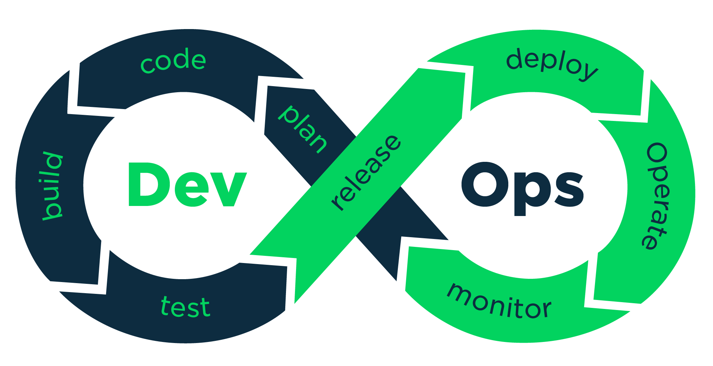
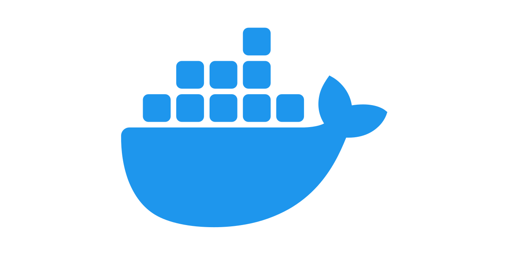

# Terraform Modules | Azure Monolithic VM

<p align="center">
  
  
  
  
  
  
</p>

<p align="center">
  <strong>Reusable Terraform modules for deploying a secure, single-VM application stack on Azure.</strong>
</p>

<p align="center">
  <a href="https://github.com/askri-7/terraform_modules/actions/workflows/iac-pipeline.yml"></a>
  <a href="https://developer.hashicorp.com/terraform"></a>
  <a href="https://azure.microsoft.com/"></a>
</p>

> **Active branch:** `release/1vm`  
> **Application:** [`secure-login-demo`](https://github.com/askri-7/secure-login-demo)

## Overview

This branch contains the infrastructure-as-code for a classic monolithic deployment. It provisions one Azure virtual machine and bootstraps the application with cloud-init and Docker Compose.

The application, reverse proxy, and database run on one host. This keeps the platform small and easy to operate for development, demonstrations, and low-traffic workloads.

## Repository Structure

```text
.
├── .github/workflows/       # Terraform CI/CD pipeline
├── cloud-init/              # VM bootstrap scripts
├── documentation/           # Architecture and Terraform notes
├── environment/             # Root configurations per environment
│   ├── demo/
│   ├── dev/
│   ├── preprod/
│   ├── prod/
│   └── qa/
├── modules/                 # Reusable Terraform building blocks
│   ├── keyvault/            # Azure Key Vault integration
│   ├── public_ip/           # Public IP module
│   ├── RG/                  # Resource Group module
│   ├── VM/                  # Virtual Machine module
│   ├── Vnet/                # Virtual Network module
│   └── workflow_identity/   # GitHub Actions federated identity
└── README.md
```

## Architecture


## Technology Stack

| Layer | Technology | Role |
| --- | --- | --- |
| Infrastructure | Terraform and AzureRM | Defines and provisions Azure resources |
| CI/CD | GitHub Actions | Runs security checks, validation, plan, and apply stages |
| Authentication | GitHub OIDC and Azure managed identity | Provides short-lived, secretless workload authentication |
| Edge / TLS | Nginx and Certbot | Terminates HTTPS and routes public traffic |
| Application | Docker Compose | Runs the frontend, backend, and supporting services |
| Database | PostgreSQL | Stores application data on persistent managed storage |
| Secrets | Azure Key Vault | Supplies runtime secrets through managed identity |
| Bootstrap | cloud-init | Installs Docker, configures storage, and starts the stack |

## Deployment Flow

### 1. Infrastructure provisioning

GitHub Actions authenticates to Azure with OpenID Connect. The pipeline then runs security and quality checks before Terraform initializes, validates, plans, and applies the configuration in `environment/dev/`.

Terraform provisions:

- A resource group
- A virtual network and subnet
- A network security group allowing TCP 22, 80, and 443
- A static public IP address
- A virtual machine with an attached managed data disk
- A user-assigned identity and federated GitHub credential
- An Azure Key Vault with role assignments for the VM and pipeline identity


### 2. VM bootstrap

On first boot, cloud-init:

1. Updates the operating system and installs Docker Engine, Docker Compose, and Azure CLI.
2. Formats and mounts the attached data disk as Docker's persistent data root.
3. Authenticates with Azure using the VM managed identity.
4. Retrieves protected database credentials from Azure Key Vault.
5. Fetches the production Compose file and reverse-proxy configuration from the application repository.
6. Writes restricted environment files and starts the production Docker Compose stack.
7. Leaves the application services and persistent storage enabled across reboots.

## Network Layout

```text
Internet
    |
    v
+-------------+     +-------------+     +----------------+
| Public IP   | --> | NSG         | --> | Azure VM       |
| static      |     | TCP 80/443  |     | Docker Compose |
+-------------+     | TCP 22      |     +--------+-------+
                    +-------------+              |
                                          +-------+-------+
                                          | VNet / Subnet |
                                          | 10.0.0.0/16   |
                                          | 10.0.1.0/24   |
                                          +---------------+
```

- **Ports 80 and 443:** Public web traffic enters through the reverse proxy.
- **Port 22:** Key-based SSH access for emergency maintenance.
- **Database access:** PostgreSQL is not exposed by the NSG.

## Security Model

This branch favors a small operational footprint while retaining basic cloud security controls:

- **Secretless CI/CD authentication:** GitHub Actions uses a federated Azure identity instead of a long-lived service principal secret.
- **Managed identity:** The VM accesses Key Vault without storing an Azure credential on disk.
- **Protected secrets:** Terraform variables and state can contain sensitive values and must be stored and accessed securely.
- **Restricted ingress:** Only SSH, HTTP, and HTTPS are allowed by the network security group.
- **Persistent storage:** Docker data is placed on the attached managed disk rather than relying only on the OS disk.
- **Single failure domain:** The VM, its application containers, and its data are not highly available in this branch.

## CI/CD Pipeline

The workflow in `.github/workflows/iac-pipeline.yml` runs three stages:

1. **Security and lint checks:** Gitleaks, Checkov, and TFLint.
2. **Terraform plan:** Provider setup, Azure OIDC login, initialization, validation, and plan artifact upload.
3. **Terraform apply:** Downloads the reviewed plan and applies it through the protected `dev` environment.

The workflow currently targets the `release/1vm` branch and uses Terraform `1.15.7` with the AzureRM `3.x` provider.

## Quick Start

This repository expects Azure credentials, GitHub OIDC configuration, Terraform variables, and application secrets to be configured before deployment.

1. Configure the Azure federated identity and required role assignments.
2. Review the variables in `environment/dev/` and provide values through approved secret or variable stores.
3. From `environment/dev/`, initialize and validate Terraform:

```bash
terraform init
terraform validate
terraform plan
```

4. Run the GitHub Actions workflow to apply the reviewed plan.
5. Monitor cloud-init and the Docker Compose services while the VM completes its first boot.

Do not commit `*.tfvars` files containing secrets, Terraform state, plans, or generated cloud-init output.

## Limitations and Future Paths

Use this branch for a single deployable application with low to moderate traffic. It is not designed for:

- High availability or automatic failover
- Horizontal auto-scaling
- Multi-region deployments
- Independent service scaling
- Workloads requiring zero-downtime upgrades

For those requirements, consider Azure Container Apps, App Service, or AKS with a managed database.

## License

This infrastructure code is provided as-is for demonstration and educational purposes.
